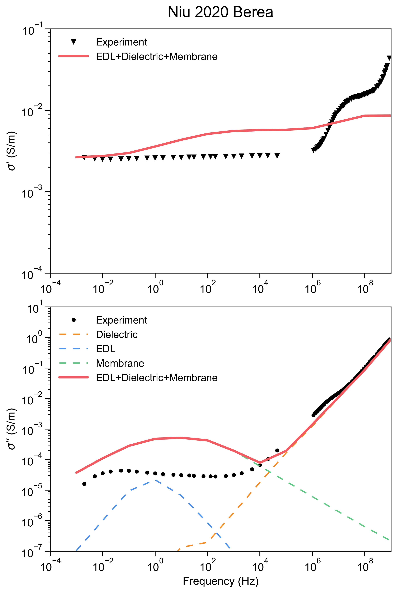

模拟使用的：pnextract 是否符合：

C:\Users\imgw\Documents\Codex\SIP模拟\sip模拟\docs\references\Pore-network extraction from micro-computerized-tomography images.pdf

这篇论文描述的原理，理论，思路？

目前膜极化不好的问题所在：
这两个 scale 的物理效果很强：length_scale 让膜弛豫时间 tau = L^2 / 4D 乘以 0.00447，等价于把特征频率推高约 224 倍；zdc_scale 把平均膜电阻从约 1.08e7 ohm 提到 9.40e7 ohm，因此大体压低膜极化幅值。

孔喉提取修正之前：

孔喉提取修正之后：

没有太大区别，证明这个不是主要原因